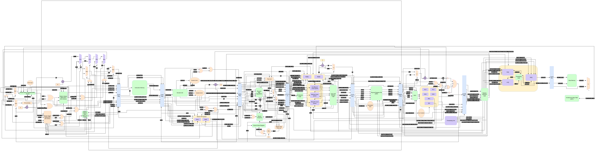

# RV32IM Dual-Issue Out-of-Order Processor

## Overview

This project implements a **dual-issue out-of-order RV32IM processor** in **SystemVerilog**. The processor exploits instruction-level parallelism through dynamic scheduling, register renaming, speculative execution, and in-order retirement.

The microarchitecture is organized as a **12-stage pipeline**:

1. Prediction
2. Fetch
3. Decode
4. Rename
5. Dispatch
6. Issue
7. Register Read
8. Execute
9. LSQ
10. Memory
11. Writeback
12. Commit

---
## Architecture Diagram

---

## Key Features

- RV32IM ISA support
- Dual-issue superscalar front-end
- Out-of-order execution
- Register renaming
- Dynamic instruction scheduling
- Branch prediction
- Load Store Queue (LSQ)
- Reorder Buffer (ROB)
- Speculative execution
- In-order commit
- Modular SystemVerilog implementation

---

## Pipeline Stages

### 1. Prediction
Generates the next program counter using branch prediction structures and speculative control-flow information.

### 2. Fetch
Fetches up to two instructions per cycle from instruction memory.

### 3. Decode
Decodes fetched instructions and extracts source/destination operands and control information.

### 4. Rename
Maps architectural registers to physical registers, eliminating WAR and WAW hazards.

### 5. Dispatch
Allocates resources such as ROB entries, issue queue entries, and LSQ entries.

### 6. Issue
Selects ready instructions for execution based on operand availability and functional unit readiness.

### 7. Register Read
Reads source operands from the physical register file or receives forwarded values.

### 8. Execute
Performs ALU operations, branch evaluation, multiplication/division, and address generation.

### 9. LSQ
Handles memory dependency tracking and load/store ordering.

### 10. Memory
Accesses data memory for load and store operations.

### 11. Writeback
Broadcasts execution results and updates destination physical registers.

### 12. Commit
Retires instructions in program order and updates architectural state.

---

## Out-of-Order Execution

The processor supports out-of-order execution using:

- Register Alias Table (RAT)
- Physical Register File (PRF)
- Reorder Buffer (ROB)
- Issue Queue / Reservation Stations
- Load Store Queue (LSQ)

Instructions may execute as soon as their operands become available, regardless of original program order. Correct architectural state is preserved through in-order commit.

---

## Branch Prediction

The prediction stage supports speculative execution to reduce branch penalties.

Possible components include:

- Branch Target Buffer (BTB)
- Pattern History Table (PHT)
- Return Address Stack (RAS)

---

## Author

Mutahir Ahmed Siddiqui

---
